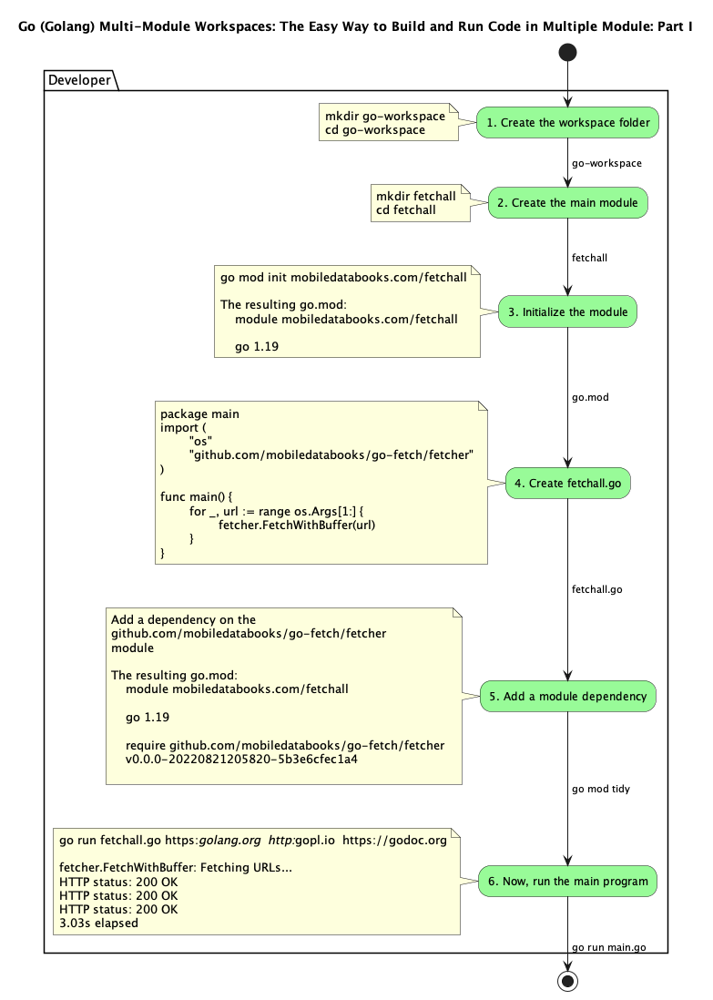
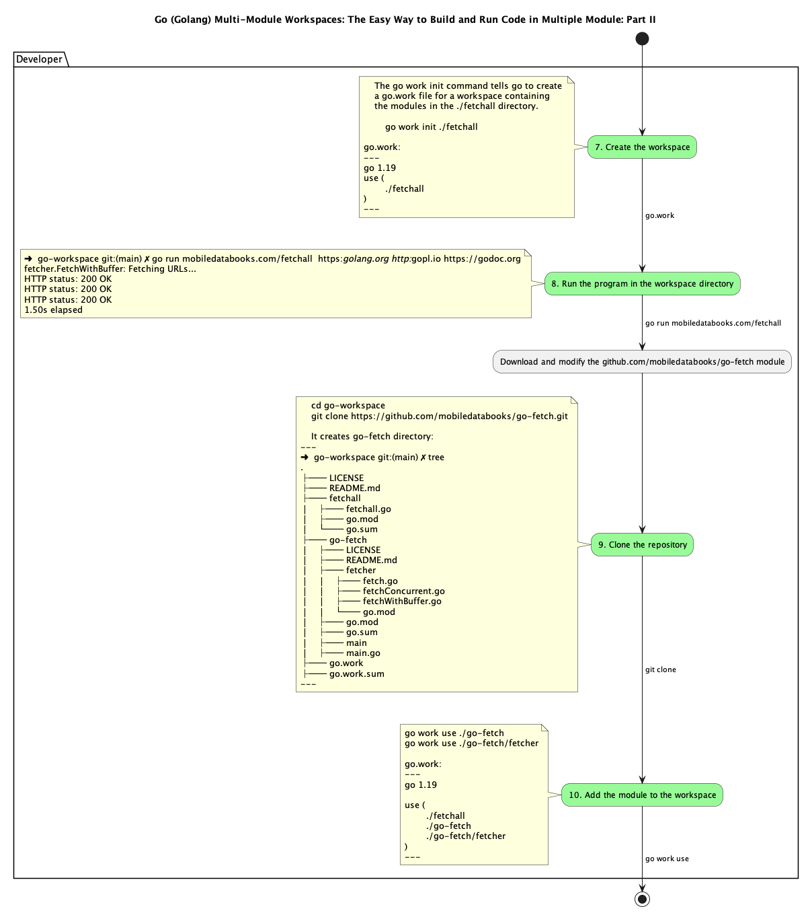
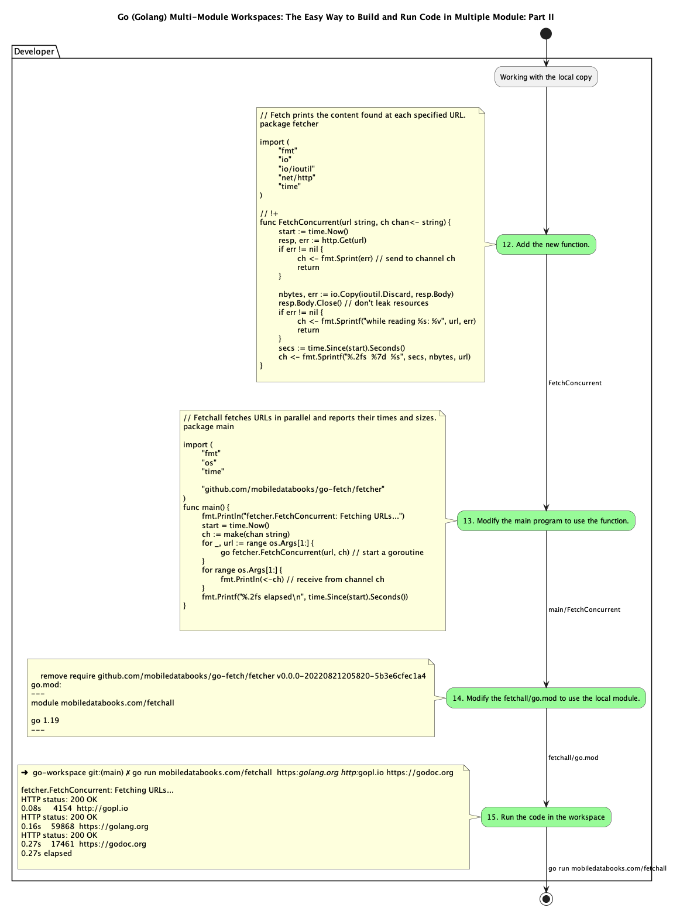

# Go (Golang) Multi-Module Workspaces: The Easy Way to Build and Run Code in Multiple Modules

If you're writing code in multiple modules at the same time, you can use multi-module workspaces to easily build and run code in those modules.

In Go, a module is a collection of related Go source files located in a single directory. A workspace is a directory containing multiple modules. When you build a Go project, the build system reads the go.mod file in the project's root directory to determine which other modules the project depends on. The build system then downloads and installs any missing dependencies. 

## Workflows
### Making Changes in One Module that Requires Changes in Another Module. How to add a feature in an upstream module and make use of the feature in your own module

The user wants to add a feature in an upstream module and make use of the feature in their own module. They open the two modules in their editor through gopls, which creates a supermodule requiring and replacing both of the modules. The editor tooling and builds done through the editor will use the build list from the supermodule, but the user will not have access to the supermodule outside their editor. The user can change their go.mod to add a replace, which will be reflected in both the editor and their go command invocations, but this is a change they will need to remember to make every time they want to use the feature.

## The Benefits of Using Multiple Modules in the Same Repository

It can be difficult to manage dependencies between multiple modules in a single repository, especially if those modules depend on each other. One way to simplify this is to use a single configuration file that links all the modules together. This can make it easier to keep track of dependencies and ensure that all modules are compatible with each other.

### Easily switch between multiple configurations with Workspaces!

This article discusses how users can easily switch between multiple configurations of dependencies when testing their modules. By making a workspace with the development versions of the dependencies and another adding the alternative versions of the dependencies with replaces, it's easy to switch between the three configurations.

#programming #golang #webdevelopment #softwareengineering #development #coding #tech #technology #computer science

This article is a part of the series of books by [Constantine Vassil](https://www.amazon.com/Constantine-Vassil/e/B09Z9S1Y77/ref=aufs_dp_fta_dsk).


[How to Build and Deploy Production-Grade Web Services with Go (Golang)](https://www.amazon.com/dp/B0BBHG87MX?binding=kindle_edition&ref=dbs_dp_rwt_sb_pc_tukn).

In these hands on projects, you'll learn how to use Golang to develop applications quickly and effectively, both locally with multi-module workspaces and on Google Cloud. You'll get hands-on experience with the language, learning how to write code, debug applications, and deploy to the cloud. These quests will help you get started with using Golang on Google Cloud, and you'll be able to apply what you've learned to your own projects.


### 1. Create the workspace folder:
```go
    mkdir go-workspace
    cd go-workspace
```

### 2. Create the main module. 
```go
mkdir fetchall
cd fetchall
```

### 3. Initialize the module.
```go
go mod init mobiledatabooks.com/fetchall
```
The resulting go.mod:

```go
module mobiledatabooks.com/fetchall

go 1.19

```

### 4. Create fetchall.go in the fetchall directory with the following contents:

```go
touch fetchall.go
```

```go
package main

import (
	"os"

	"github.com/mobiledatabooks/go-fetch/fetcher"
)

func main() {
	for _, url := range os.Args[1:] {
		fetcher.FetchWithBuffer(url)
	}
}
```

### 5. Add a dependency on the github.com/mobiledatabooks/go-fetch/fetcher module by using:
```go
go mod tidy
```

The resulting go.mod:

```go
module mobiledatabooks.com/fetchall

go 1.19

require github.com/mobiledatabooks/go-fetch/fetcher v0.0.0-20220821205820-5b3e6cfec1a4
```

### 6. Now, run the main program

```go
go run fetchall.go https://golang.org http://gopl.io https://godoc.org

fetcher.FetchWithBuffer: Fetching URLs...
HTTP status: 200 OK
HTTP status: 200 OK
HTTP status: 200 OK
3.03s elapsed

```

### 7. Create the workspace

In this step, we’ll create a go.work file to specify a workspace with the module.

Change to the workspace directory
```go
cd go-workspace
```
In the workspace directory, run:
```go
go work init ./fetchall
```
The go work init command tells go to create a go.work file for a workspace containing the modules in the ./fetchall directory.

Created go.work
```go
go 1.19

use ./fetchall
```

The go.work file has similar syntax to go.mod.

The go directive tells Go which version of Go the file should be 
interpreted with. It’s similar to the go directive in the go.mod file.

The use directive tells Go that the module in the hello directory 
should be main modules when doing a build.

So in any subdirectory of workspace the module will be active.

### 8. Run the program in the workspace directory

In the workspace directory, run:

```go
go run mobiledatabooks.com/fetchall  https://golang.org http://gopl.io https://godoc.org

0.68s     4154  http://gopl.io
0.78s    17461  https://godoc.org
1.29s    59769  https://golang.org
1.29s elapsed
```

The Go command includes all the modules in the workspace as main modules. 
This allows us to refer to a package in the module, even outside the module. 
Running the go run command outside the module or the workspace would result 
in an error because the go command wouldn’t know which modules to use.

Next, we’ll add a local copy of the go-fetch module to the workspace. 
We’ll then add a new function to the fetcher package that we can use instead of Fetch.

## Download and modify the github.com/mobiledatabooks/go-fetch module
 
In this step, we’ll download a copy of the Git repo containing the 
github.com/mobiledatabooks/go-fetch module, add it to the workspace, and then add a new function to it that we will use from the main program.


### 9. Clone the repository

```go
cd go-workspace
```
From the workspace directory, run the git command to clone the repository:

```go
cd go-workspace
git clone https://github.com/mobiledatabooks/go-fetch.git
```
It creates go-fetch directory
```go

➜  go-workspace git:(main) ✗ tree
.
├── LICENSE
├── README.md
├── fetchall
│   ├── fetchall.go
│   ├── go.mod
│   └── go.sum
├── go-fetch
│   ├── LICENSE
│   ├── README.md
│   ├── fetcher
│   │   ├── fetch.go
│   │   ├── fetchConcurrent.go
│   │   ├── fetchWithBuffer.go
│   │   └── go.mod
│   ├── go.mod
│   ├── go.sum
│   ├── main
│   ├── main.go
├── go.work
├── go.work.sum
```

### 10. Add the module to the workspace
```go
go work use ./go-fetch
go work use ./go-fetch/fetcher
```

The go work use command adds a new module to the go.work file. 
It will now look like this:

go.work
```go
use (
	./fetchall
	./go-fetch
    ./go-fetch/fetcher
)
```

The module now includes both the mobiledatabooks.com/fetchall module, the github.com/mobiledatabooks/go-fetch module and the github.com/mobiledatabooks/go-fetch/fetcher module.


## Working with the local copy

This will allow us to use the new code we will write in our copy of 
the stringutil module instead of the version of the module in the 
module cache that we downloaded with the go get command.

### 12. Add the new function.

We’ll add a new function to fetch concurrently to the github.com/mobiledatabooks/go-fetch/fetcher package.

Create a new file named fetchConcurrent.go in the go-workspace/go-fetch/fetcher directory containing the following contents:


## Add concurrency

- The program starts with a channel ch of type string to receive the results of the fetching of the URLs in parallel (concurrent).
- Then, for each URL in the command line arguments (concurrent), it starts a goroutine to fetch the URL and return the result to the channel.
- Finally, for each URL in the command line arguments (concurrent) (wait for the results of the goroutines), it receives from channel ch and prints the result.


```go
// Fetch prints the content found at each specified URL.
package fetcher

import (
	"fmt"
	"io"
	"io/ioutil"
	"net/http"
	"time"
)

// !+
func FetchConcurrent(url string, ch chan<- string) {
	start := time.Now()
	resp, err := http.Get(url)
	if err != nil {
		ch <- fmt.Sprint(err) // send to channel ch
		return
	}

	nbytes, err := io.Copy(ioutil.Discard, resp.Body)
	resp.Body.Close() // don't leak resources
	if err != nil {
		ch <- fmt.Sprintf("while reading %s: %v", url, err)
		return
	}
	secs := time.Since(start).Seconds()
	ch <- fmt.Sprintf("%.2fs  %7d  %s", secs, nbytes, url)
}

//!-

```

### 13. Modify the main program to use the function.

Modify the contents of go-workspace/fetchall/fetchall.go to contain the following contents:

```go
//!+

// Fetchall fetches URLs in parallel and reports their times and sizes.
package main

import (
	"fmt"
	"os"
	"time"

	"github.com/mobiledatabooks/go-fetch/fetcher"
)

//!-

func main() {
	fmt.Println("fetcher.Fetch: Fetching URLs...")
	start := time.Now()
	for _, url := range os.Args[1:] {
		fetcher.Fetch(url)
	}
	fmt.Printf("%.2fs elapsed\n", time.Since(start).Seconds())
	fmt.Println()
	fmt.Println("fetcher.FetchConcurrent: Fetching URLs...")
	start = time.Now()
	ch := make(chan string)
	for _, url := range os.Args[1:] {
		go fetcher.FetchConcurrent(url, ch) // start a goroutine
	}
	for range os.Args[1:] {
		fmt.Println(<-ch) // receive from channel ch
	}
	fmt.Printf("%.2fs elapsed\n", time.Since(start).Seconds())
}

//!-

```

### 14. Modify the fetchall/go.mod to use the local module.
remove require github.com/mobiledatabooks/go-fetch/fetcher v0.0.0-20220821205820-5b3e6cfec1a4


```go
module mobiledatabooks.com/fetchall

go 1.19
```

### 15. Run the code in the workspace

From the workspace directory, run

```go
go run mobiledatabooks.com/fetchall  https://golang.org http://gopl.io https://godoc.org
```

The Go command finds the mobiledatabooks.com/fetchall module specified in the command line in the fetchall directory specified by the go.work file, and similarly resolves the github.com/mobiledatabooks/go-fetch/fetcher import using the go.work file.

go.work can be used instead of adding replace directives to work across multiple modules.


### Make a change in one module and use it in another.

Since the two modules are in the same workspace it’s easy to make a change in one module and use it in another.

Future step

Now, to properly release these modules we’d need to make a release of 
the github.com/mobiledatabooks/go-fetch/fetcher module, for example at v0.1.0. 
This is usually done by tagging a commit on the module’s version control repository. See the module release workflow documentation for more details. 
Once the release is done, we can increase the requirement on the 
github.com/mobiledatabooks/go-fetch/fetcher module in fetchall/go.mod:
by deleting everhything after "go 1.19" and performing go mod tidy

```go
go mod tidy
```

# Module release and versioning workflow

https://go.dev/doc/modules/release-workflow

When you develop modules for use by other developers, you can follow a workflow that helps ensure a reliable, consistent experience for developers using the module. 
This topic describes the high-level steps in that workflow.

See also

If you’re merely wanting to use external packages in your code, be sure to see 
Managing dependencies.
With each new version, you signal the changes to your module with its version number. 
For more, see Module version numbering.

Common workflow steps

The following sequence illustrates release and versioning workflow steps for an example 
new module. For more about each step, see the sections in this topic.

1. Begin a module and organize its sources to make it easier for developers to use and for you to maintain.

If you’re brand new to developing modules, check out Tutorial: Create a Go module.

In Go’s decentralized module publishing system, how you organize your code matters. 
For more, see Managing module source.

2. Set up to write local client code that calls functions in the unpublished module.

Before you publish a module, it’s unavailable for the typical dependency management workflow using commands such as go get. A good way to test your module code at this stage is to try it while it is in a directory local to your calling code.

See Coding against an unpublished module for more about local development.

3. When the module’s code is ready for other developers to try it out, 
begin publishing v0 pre-releases such as alphas and betas. See Publishing pre-release versions for more.

go version reports the Go version used to build each executable file named on the command line.

The -m flag causes go version to print each executable’s embedded module version information, when available. For each executable, go version -m prints a table with tab-separated columns like the one below.


```bash
go-workspace git:(main) ✗ go version -m .
fetchall/fetchall: go1.19
	path	command-line-arguments
	dep	github.com/mobiledatabooks/go-fetch/fetcher	v0.0.0-20220821183956-22e7be266fcc	h1:xmpYSDV6Z+NUOcgY29EaUV72F/TxN9WrjNaJslrM5aA=
	build	-compiler=gc
	build	CGO_ENABLED=0
	build	GOARCH=arm64
	build	GOOS=darwin
go-fetch/main: go1.19
	path	command-line-arguments
	dep	github.com/mobiledatabooks/go-fetch/fetcher	v0.0.0-20220821183956-22e7be266fcc	h1:xmpYSDV6Z+NUOcgY29EaUV72F/TxN9WrjNaJslrM5aA=
	build	-compiler=gc
	build	CGO_ENABLED=0
	build	GOARCH=arm64
	build	GOOS=darwin
```

The Go Programming Language is a book that provides an in-depth look at the Go programming language. The book also includes a number of code examples to illustrate various concepts.
```
The Go Programming Language
Alan A. A. Donovan
Google Inc.
Brian W. Kernighan
Princeton University
Copyright © 2016 Alan A. A. Donovan & Brian W. Kernighan

SECTION 1.6. FETCHING URLS CONCURRENTLY
```

